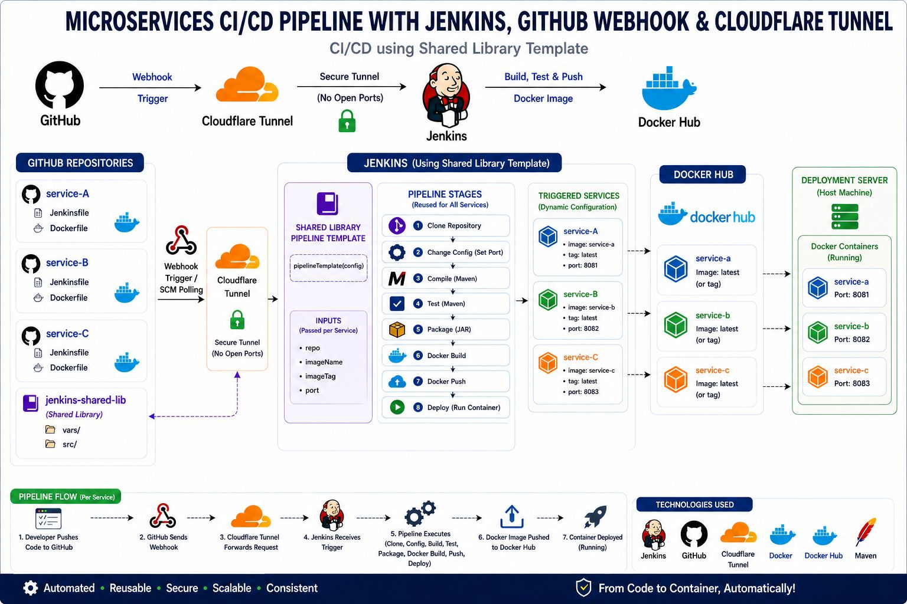

# 🚀 Microservices CI/CD Pipeline with Jenkins, GitHub Webhook & Cloudflare Tunnel

This project demonstrates a complete **CI/CD pipeline for microservices** using a **Jenkins Shared Library template**.
It automates the full lifecycle from code push to container deployment.

---

## 📌 Architecture Overview


The pipeline integrates the following components:

* **GitHub** → Source code & Webhook trigger
* **Cloudflare Tunnel** → Secure connection (no open ports)
* **Jenkins** → CI/CD automation using Shared Library
* **Docker Hub** → Container image registry
* **Deployment Server** → Runs Docker containers

---

## ⚙️ Pipeline Flow

1. Developer pushes code to GitHub
2. GitHub sends a webhook
3. Cloudflare Tunnel securely forwards the request to Jenkins
4. Jenkins triggers the pipeline
5. Pipeline executes all stages:

   * Clone
   * Change Config (Port)
   * Compile
   * Test
   * Package
   * Docker Build
   * Docker Push
   * Deploy
6. Docker image is pushed to Docker Hub
7. Container is deployed and runs on the server

---

## 🧩 Shared Library (Core Concept)

The pipeline is built using a **reusable Jenkins Shared Library**:

```groovy
pipelineTemplate(config)
```

### 🔑 Inputs (Dynamic per Service)

* `repo` → GitHub repository
* `imageName` → Docker image name
* `imageTag` → Docker tag (default: latest)
* `port` → Application port

---

## 🏗️ Pipeline Stages

| Stage         | Description                      |
| ------------- | -------------------------------- |
| Clone         | Clone repository from GitHub     |
| Change Config | Set application port dynamically |
| Compile       | Build using Maven                |
| Test          | Run unit tests                   |
| Package       | Generate JAR file                |
| Docker Build  | Build Docker image               |
| Docker Push   | Push image to Docker Hub         |
| Deploy        | Run container on server          |

---

## 📦 Microservices Setup

The system supports multiple services using the same template:

* **service-a** → Port 8081
* **service-b** → Port 8082
* **service-c** → Port 8083

Each service:

* Has its own repository
* Uses the same shared pipeline
* Passes different configuration values

---

## 🐳 Docker Images

Images are pushed to Docker Hub:

```
service-a:latest
service-b:latest
service-c:latest
```

---

## 🚀 Deployment

Containers are deployed on the host machine:

| Service   | Port |
| --------- | ---- |
| service-a | 8081 |
| service-b | 8082 |
| service-c | 8083 |

---

## 🔐 Security

* No open ports on Jenkins server
* Secure communication via Cloudflare Tunnel
* Credentials managed in Jenkins

---

## 🛠️ Technologies Used

* Jenkins (Shared Library)
* GitHub
* Cloudflare Tunnel
* Docker
* Docker Hub
* Maven
* Spring Boot

---

## 💡 Key Features

* ✅ Reusable pipeline template
* ✅ Dynamic configuration per service
* ✅ Fully automated CI/CD
* ✅ Scalable for multiple microservices
* ✅ Secure deployment

---

## 📷 Architecture Diagram

> See the pipeline diagram in this repository for full visualization.

---


---


---

## ⭐ Final Note

This project demonstrates how to build a **scalable, reusable, and secure CI/CD pipeline** for microservices using Jenkins Shared Library.

---
